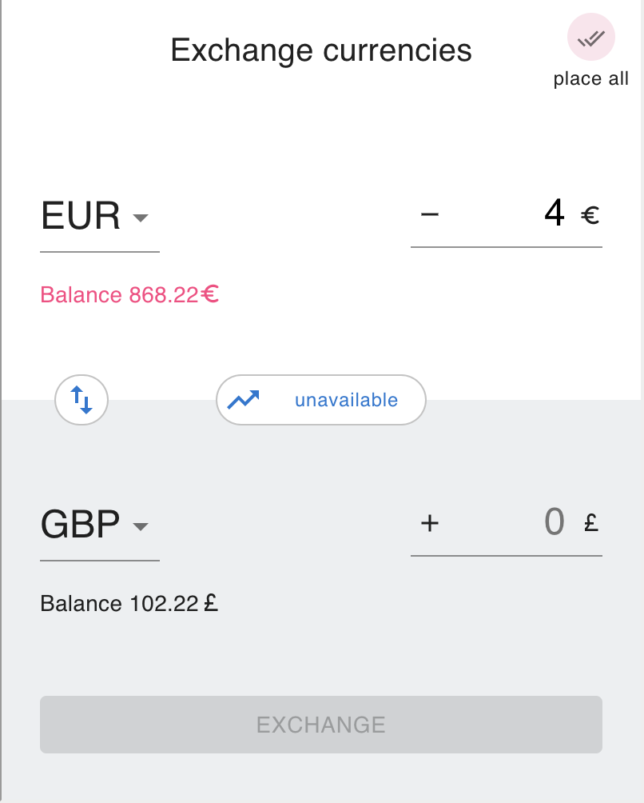

# Currency exchange widget

## Review locally:

### Run dev server: 

#### Install packages: 
`yarn install && yarn install:client`

#### Run iframe and react-app: 
`yarn run-widget`

Widget loaded in iframe is available on:
*  http://127.0.0.1:8081
*  http://192.168.8.152:8081
*  http://192.168.8.106:8081

React app is available in port 3000: 
* http://localhost:3000/

### Test:
`yarn test`

### Build to production:
`yarn build`

## Technical and architectural decisions: 

* Autonomous data fetching;
* Encapsulated calculation logic running in the background;
* Separated UI and data handling;
* Failure handling (disabled due to limited API availability on lines [here ](widget/src/store/modules/currency-rates/sagas.ts#L44) and [here ](widget/src/store/modules/currency-rates/sagas.ts#L45));
* Concurrent request handling using redux-sagas;
* Direct exchange transfers with a possibility to integrate API. Disabling of user actions' implemented;
* Input formatting and on-app format handling;
* React.js, redux, redux-saga middleware and typescript stack;

## Functionality: 

* 10 second rate refresh;
* Three pockets' storages: GBP, USD, EUR;
* Unavailability state ( [comment line here ](widget/src/api/currency-rates/index.ts#L9) to enable );
* Pocket 'flip' - replace pockets vertically;
* Currency rate view change: press the currency rate chip in the center of widget;
* Reverse rate calculation;

 . 
 . 
